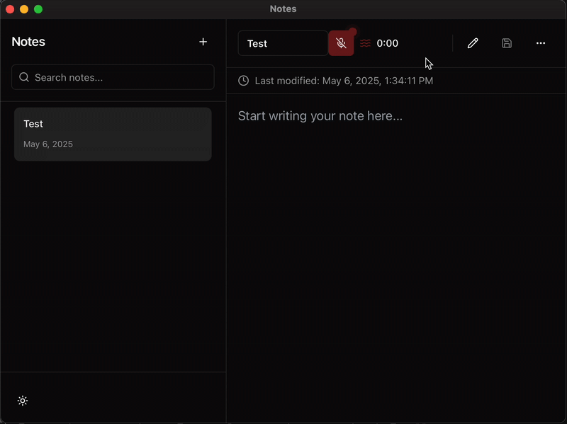

# Whisper Notes Pro 🎙️📝➕

Transform your voice into text effortlessly with Whisper Notes Pro - a modern, lightweight note-taking app powered by whisper.cpp. Capture your thoughts, ideas, and notes through speech, all processed locally on your machine with advanced audio processing support.

[]([https://deepwiki.com/mzazakeith/PuppetMaster](https://deepwiki.com/mzazakeith/whisper-notes-pro)

## ✨ Features

- **Voice-to-Text**: Seamlessly convert speech to text using state-of-the-art Whisper technology
- **Local Processing**: All speech recognition happens offline on your device - no cloud services needed
- **High-Quality Audio**: Advanced audio sampling and processing for optimal voice recognition
- **Modern UI**: Beautiful, responsive interface with dark/light theme support
- **Cross-Platform**: Available for macOS (including Apple Silicon), Windows, and Linux
- **Privacy-First**: Your voice data never leaves your computer
- **Instant Search**: Quick note search with real-time filtering

## 📸 Demo

Here's a sneak peek of Whisper Notes Pro in action:

**Light Mode:**


**Dark Mode:**


## 🚀 Getting Started

### Prerequisites
- [Rust](https://rustup.rs/) (latest stable)
- [Node.js](https://nodejs.org/) (v16 or later)
- [pnpm](https://pnpm.io/) (v8 or later)

### Setup

```bash
# Clone the repository
git clone https://github.com/yourusername/whisper-notes.git

# Navigate to the app directory
cd whisper-notes/app

# Install dependencies
pnpm install

# Download the Whisper model (required for speech recognition)
pnpm run download-model

# Run in development mode
pnpm tauri dev
```

### Building

```bash
# Build for production (from the app directory)
pnpm tauri build
```

## 🛠️ Technical Details

### Audio Processing
- Supports high-quality audio recording with automatic resampling
- Optimized for Apple Silicon and x86 architectures
- Uses CPAL for cross-platform audio capture
- Implements efficient audio processing with the Rubato resampler

### Speech Recognition
- Powered by whisper.cpp for efficient local processing
- Uses the ggml-base model by default (can be configured to use medium/large)
- Supports multiple languages (configurable)
- Optimized for real-time transcription

### Frontend Stack
- React with TypeScript
- Radix UI components for accessibility
- Tailwind CSS for styling
- Custom theme system with dark/light mode support
- Zustand for state management

### Backend Stack
- Tauri for cross-platform desktop support
- Rust for performance-critical operations
- Custom audio processing pipeline

## 🗺️ Roadmap

- [ ] System audio recording support
- [ ] Multiple language model support
- [ ] Custom hotkeys configuration
- [ ] Export notes in various formats (MD, PDF, etc.)
- [ ] Rich text editing
- [ ] Cloud sync (optional)
- [ ] Voice commands for app control
- [ ] Note organization with folders/tags

## 🐛 Bug Reports

Found a bug? Please open an issue with:
- Your OS version and architecture (x86/ARM)
- Steps to reproduce
- Expected behavior
- Actual behavior
- Relevant logs (if available)

## 🤝 Contributing

Contributions are welcome! Please check our [Contributing Guide](CONTRIBUTING.md) for details.

### Development Workflow

1. Fork the repository
2. Create your feature branch (`git checkout -b feature/AmazingFeature`)
3. Make your changes
4. Run tests and ensure everything works
5. Commit your changes (`git commit -m 'Add some AmazingFeature'`)
6. Push to the branch (`git push origin feature/AmazingFeature`)
7. Open a Pull Request

## 📝 License

MIT License - feel free to use and modify as you wish!

---

Built with ❤️ using [Tauri](https://tauri.app), [React](https://reactjs.org), [Rust](https://www.rust-lang.org), and [whisper.cpp](https://github.com/ggerganov/whisper.cpp)

## Credits

This project was inspired by and forked from [AsyncFuncAI's Tauri Whisper Notes](https://github.com/AsyncFuncAI/whisper-notes). Many thanks to them for open-sourcing their work which served as an excellent foundation.
